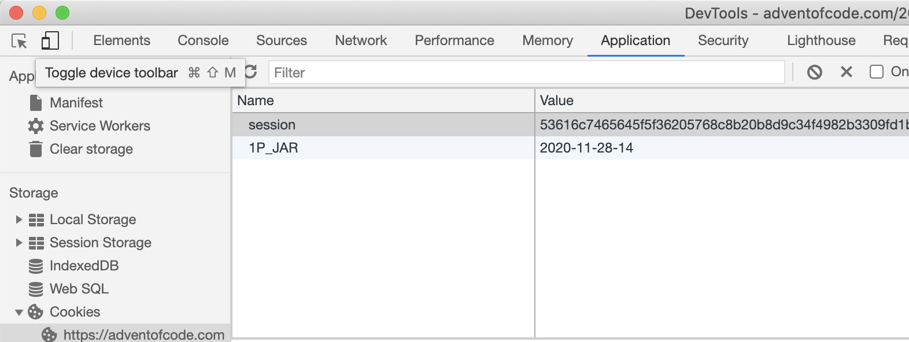

<!-- README.md is generated from README.Rmd. Please edit that file -->

# adventr

This package provides one single function: `read_advent_of_code`, which
directly load into your session the problem data of a specific day of
the [Advent of Code](https://adventofcode.com/).

This will spare you some manipulations and reduce the pollution of your
download folder.

## Installation

``` r
# install.packages("devtools")
devtools::install_github("benjaminguinaudeau/adventr")
```

## How to use?

Once you have initialized your cookie (see below), you can read the
problem data of any day using `read_advent_of_code`:

``` r
library(adventr)

read_advent_of_code(day = 1) %>%
  dplyr::glimpse()
#>  chr [1:200] "1511" "1344" "1925" "1970" "1864" "1951" "1557" "1984" "1743" ...
```

## How does it work?

If you tried to read the data with the url, you have certainly noticed
the request was blocked. The website will only provide the data, if you
are logged in. To simulate a logged in request, we log in using a
browser and extract the identification cookie, which can then be
included in a a request.

### Get your cookie

1.  Navigate to the website with chrome.
2.  Open the developer tools.
3.  Open the tab ‘Application’
4.  You should see a table with a list of cookies. Find the cookie named
    “session” and copy-paste it into one of the two chunks below (As
    shown in the picutre)



Cookies can be fed in two ways to the function. You can either specify
the `cookie` parameter as a string or set it in an environment variable
named `ADVENT_COOKIE`.

``` r
# cookie as an object in the session
cookie <- "<paste_your_cookie>"

read_advent_of_code(day = 1, cookie = cookie) %>%
  dplyr::glimpse()
```

``` r
# cookie as an environment variable
Sys.setenv("ADVENT_COOKIE" = "<paste_your_cookie>")

read_advent_of_code(day = 1) %>%
  dplyr::glimpse()
```

Once this is done, you can freely read problem data, without any further
manipulation.

### Day 1

``` r
read_advent_of_code(day = 1) %>%
  dplyr::glimpse()
#>  chr [1:200] "1511" "1344" "1925" "1970" "1864" "1951" "1557" "1984" "1743" ...
```

### Day 2

``` r
read_advent_of_code(day = 2) %>%
  dplyr::glimpse()
#>  chr [1:1000] "6-7 w: wwhmzwtwwk" "10-12 q: qqqqqqqqqqqdqqq" ...
```

### Day 3

``` r
read_advent_of_code(day = 3) %>%
  dplyr::glimpse()
#>  chr [1:323] ".........#..##.##.............." ...
```
